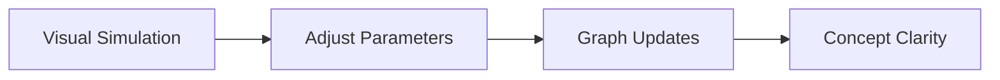

<h1 align="center">⚛️ Phyzics — Interactive Physics Learning</h1>

<p align="center">
<b>Visualize • Experiment • Understand</b><br/>
<i>Real-time physics simulations in your browser</i>
</p>

<p align="center">


</p>

---

<div align="center">

<h3>🚀 Master Physics Through Interaction</h3>

<p>
Phyzics turns formulas into <b>real-time visual simulations</b>.<br/>
Change variables → Watch graphs update → Build intuition instantly.
</p>

</div>

---

## ✨ Core Features

<details open>
<summary><b>🎯 Click to expand features</b></summary>

<ul>
<li>Real-time formula visualization</li>
<li>Dynamic graphs & sliders</li>
<li>Projectile motion simulation</li>
<li>Snell’s law light refraction demo</li>
<li>Thermodynamics parameter explorer</li>
<li>Instant calculations (no reload)</li>
<li>Pure Vanilla JS — no heavy frameworks</li>
</ul>

</details>

---

## 🧬 Physics Modules

<details>
<summary><b>📘 Classical Mechanics</b></summary>

- Projectile Motion  
- Newton’s Laws  
- Work & Energy  

</details>

<details>
<summary><b>🌊 Waves & Optics</b></summary>

- Snell’s Law  
- Refraction & Reflection  
- Interference (planned)  

</details>

<details>
<summary><b>🔥 Thermodynamics</b></summary>

- Heat transfer  
- Gas laws  
- Entropy visualization  

</details>

<details>
<summary><b>⚡ Electromagnetism</b></summary>

- Electric fields  
- Basic circuits  
- Potential difference  

</details>

<details>
<summary><b>🧪 Modern Physics</b></summary>

- Relativity basics  
- Quantum concepts (planned)  

</details>

---

## 🧠 Learning Flow

<div align="center">

<b>See → Change → Observe → Understand</b>

</div>



---

## 🛠️ Tech Stack

<div align="center">

<table>
<tr>
<th>Layer</th>
<th>Technology</th>
</tr>
<tr>
<td>Structure</td>
<td>HTML5</td>
</tr>
<tr>
<td>Styling</td>
<td>CSS3 (animations + responsive)</td>
</tr>
<tr>
<td>Logic</td>
<td>Vanilla JavaScript</td>
</tr>
<tr>
<td>Rendering</td>
<td>Canvas / SVG</td>
</tr>
</table>

</div>

---

## 📂 Project Structure

```bash
phyzics/
│── index.html
│── style.css
│── script.js
│── simulations/
│    ├── projectile.js
│    ├── snell.js
│    ├── thermo.js
│── README.md
```

---

## 🚀 Getting Started

```bash
git clone https://github.com/your-username/phyzics.git
cd phyzics
open index.html
```

No dependencies. Runs directly in the browser.

---

## 🔮 Roadmap

- [ ] 40+ interactive formulas  
- [ ] Graph export (PNG/SVG)  
- [ ] Dark / Light mode  
- [ ] Mobile touch controls  
- [ ] Quantum visualization engine  
- [ ] Save experiment states  

---

## 🎯 Target Users

<div align="center">

Physics students • JEE/NEET aspirants • Visual learners • Educators

</div>

---

## 📸 Preview

<div align="center">

<i>Interactive sliders → Live graphs → Concept animations</i><br/>
Preview GIF coming soon…

</div>

---

## 👨‍💻 Author

<div align="center">

<b>Nirmalya Kumar Mohanty</b><br/>
CSE Student • Physics + Code Enthusiast

</div>

---

## ⭐ First Commit

Initial simulation engine, UI concept, and modular physics structure.

<div align="center">

<b>Building the future of visual physics learning 🚀</b>

</div>
