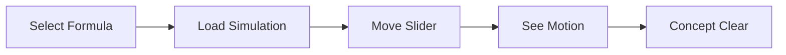

<h1 align="center">⚛️ Phyzics</h1>

<p align="center">
<b>Interactive Physics. Real-Time Simulations. Zero Memorization.</b><br/>
<i>Experiment → Visualize → Understand</i>
</p>

<p align="center">
<a href="https://phyzics.vercel.app/" target="_blank">

</a>
</p>

<p align="center">


</p>

---

## 🧪 Live Simulation Preview

<p align="center">


</p>

<p align="center">
<a href="https://phyzics.vercel.app/" target="_blank">

</a>
</p>

---

## ✨ Why Phyzics?

<div align="center">

🧠 Learn by changing variables  
📈 Watch graphs update instantly  
🎯 Understand concepts visually  
⚡ No reload • No frameworks • Pure physics  

</div>

---

## 🔬 Current Simulations

<p align="center">


</p>

---

## 🧬 Formula Engine

<details>
<summary><b>📦 Click to view formula structure</b></summary>

```js
{
  name: "Simple Pendulum",
  category: "Mechanics",
  equation: "T = 2π√(L/g)",
  explanation: "Oscillation period",
  example: "Grandfather clock",
  simulationType: "pendulum",
  isCustom: true
}
```

✔️ Plug-and-play formulas  
✔️ Auto UI rendering  
✔️ Simulation binding  

</details>

---

## 🛠️ Tech Stack

<p align="center">


</p>

---

## 🧠 Learning Flow



---

## 📂 Project Structure

```bash
phyzics/
│── index.html
│── style.css
│── script.js
│── formulas.js
│── analyze_sims.py
│── einstein_tesla.gif
│── jimmy-neutron-atom.gif
```

---

## 🚀 Run Locally

<p align="center">

</p>

```bash
git clone https://github.com/nirmalyamohanty/phyzics.git
cd phyzics
open index.html
```

Or just:

<p align="center">
<a href="https://phyzics.vercel.app/" target="_blank">

</a>
</p>

---

## 🔮 Roadmap

- [ ] 40+ interactive formulas  
- [ ] Graph plotting engine  
- [ ] Thermodynamics module  
- [ ] Electromagnetism simulations  
- [ ] Quantum visualization  
- [ ] Save experiment states  
- [ ] Mobile touch controls  

---

## 👨‍💻 Author

<p align="center">
<b>Nirmalya Kumar Mohanty</b><br/>
Physics + Code • Building a browser physics lab 🔬
</p>

---

## ⭐ First Commit

✔️ Formula engine initialized  
✔️ Modular simulation system  
✔️ Mechanics simulations added  
✔️ GIF visual previews integrated  

<p align="center">
<b>Click the demo. Play with physics. 🚀</b>
</p>
